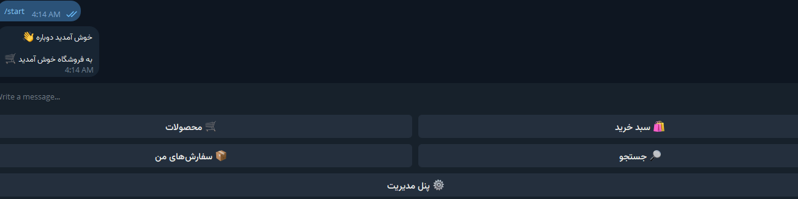
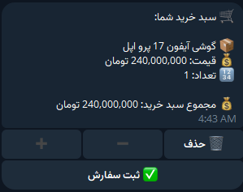
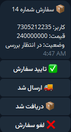
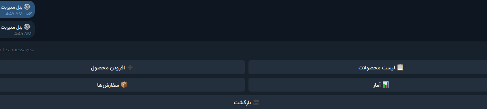

# 🛒 Telegram Shop Bot

A modular Telegram e-commerce bot built with **Python** and **python-telegram-bot v22**.

The bot provides a complete shopping experience directly inside Telegram, allowing users to browse products, search for products, manage their cart, place orders, and manage their account.

Administrators can manage products and orders through a dedicated admin panel.

---

## ✨ Features

### 👤 User Features

* User registration
* Browse available products
* Product search using RapidFuzz
* View product details
* Product image support
* Add products to cart
* Increase product quantity
* Decrease product quantity
* Remove products from cart
* Place orders
* Cancel orders
* View order history
* User profile management

### 📊 Admin Features

* Dedicated admin panel
* Add products
* Edit products
* Delete products
* Product management
* Order management
* Update order status
* View statistics
* Product image support

---

## 🛠 Technologies

* **Python**
* **python-telegram-bot v22**
* **SQLite**
* **RapidFuzz**
* **python-dotenv**

---

## 🏗 Project Architecture

The project follows a modular architecture designed to separate Telegram interactions, business logic, database operations, and UI components.

```text
telegram_shop_bot/
│
├── database/          # Database connection and database operations
│
├── handlers/          # Telegram commands and callback handlers
│
├── keyboards/         # Telegram reply and inline keyboards
│
├── models/            # Database models
│
├── services/          # Business logic
│
├── screenshots/       # Project screenshots
│
├── .env.example       # Example environment configuration
├── .gitignore         # Git ignored files
├── config.py          # Application configuration
├── main.py            # Application entry point
├── requirements.txt   # Python dependencies
└── README.md          # Project documentation
```

### Architecture Overview

**Handlers**

Handle Telegram commands, messages, callback queries, and user interactions.

**Models**

Handle database-related operations and data access.

**Services**

Contain the application's business logic and connect handlers with models.

**Database**

Handles SQLite database connections and database operations.

**Keyboards**

Contains Telegram reply keyboards and inline keyboards used throughout the bot.

This structure keeps the project organized and makes it easier to maintain and extend.

---

# 📷 Screenshots

## 🏠 Main Menu

The main user interface where users can access the shop and their account.



---

## 🛍 Products

Users can browse available products and view product information.


---

## 🛒 Shopping Cart

Users can manage products and quantities before placing an order.



---

## 📦 Orders

Users can place and manage their orders.



---

## ⚙️ Admin Panel

Administrators can manage the shop through the dedicated admin panel.



---

## ✏️ Edit Product

Administrators can update product information through the admin panel.


---

# ⚙️ Installation

## 1. Clone the repository

```bash
git clone YOUR_REPOSITORY_URL
```

## 2. Enter the project directory

```bash
cd telegram_shop_bot
```

## 3. Install dependencies

```bash
pip install -r requirements.txt
```

---

# 🔐 Configuration

Create a `.env` file in the project root.

```env
BOT_TOKEN=your_bot_token_here
ADMIN_ID=your_admin_id_here
```

Replace the values with your own Telegram Bot Token and Telegram Admin ID.

> **Important:** Never upload your `.env` file or bot token to GitHub.

---

# ▶️ Running the Bot

Start the bot with:

```bash
python main.py
```

---

# 🔒 Security

Sensitive configuration files are excluded from version control.

The following files should not be committed:

```text
.env
database/database.db
__pycache__/
*.pyc
.venv/
venv/
```

Use `.env.example` as a template for configuring the bot.

---

# 🚀 Future Improvements

Possible future improvements include:

* Online payment integration
* Product categories
* Advanced analytics dashboard
* Docker deployment
* Cloud database support
* Multi-language support
* Improved admin analytics
* Automated order notifications

---

# 👨‍💻 Author

**Saman Ziarati**

Built as a portfolio project to demonstrate Python, Telegram Bot development, database design, and modular software architecture.
